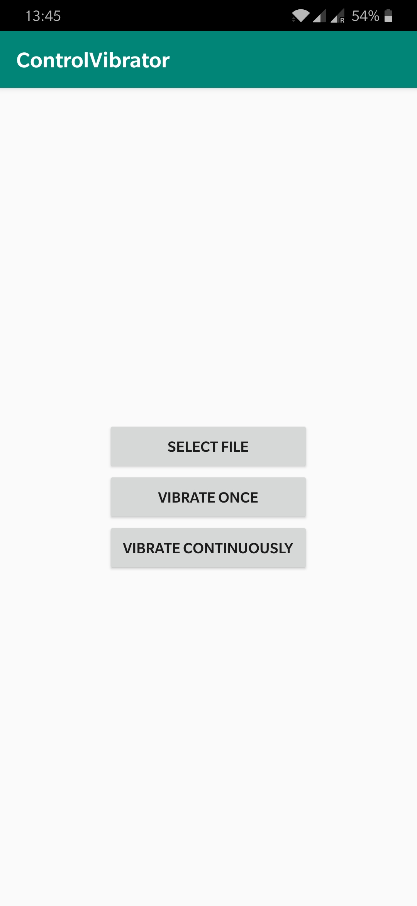

<!--
 * @Author: CodeOfSH
 * @Github: https://github.com/CodeOfSH
 * @LastEditors: CodeOfSH
 * @Description: 
 * @Date: 2019-02-11 14:48:31
 * @LastEditTime: 2019-04-10 15:00:35
 -->
# ControlVibrator
This is an android app for control the vibration device on phone.

    

## Button Usage
In the App, it could load txt file from the phone's storage. Then the vibrator could vibrate by the pattern written in the file
* "Select File" button is used for selecting file form the storage
* "Vibrate Once" button is used for vibrate the patten for one time
* "Vibrate Contiously" button is used for vibrate until the user choose to stop

## Patten File Format
The patten must be written in such format. "stoptime" means how much time it takes between two vibration gaps. "vibrate time" means how much time it takes during a vibration

    stoptime1
    vibratetime1
    stoptime2
    vibratetime2
    stoptime3
    vibratetime3
    ...

